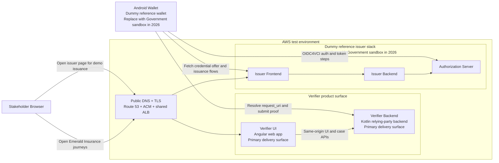
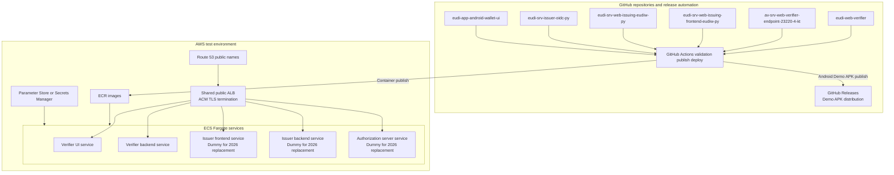
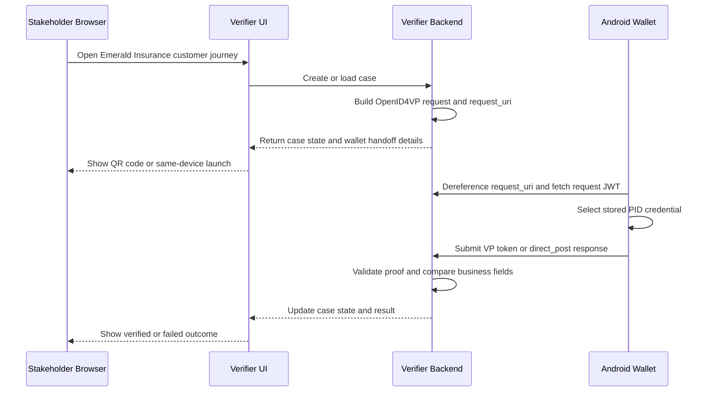
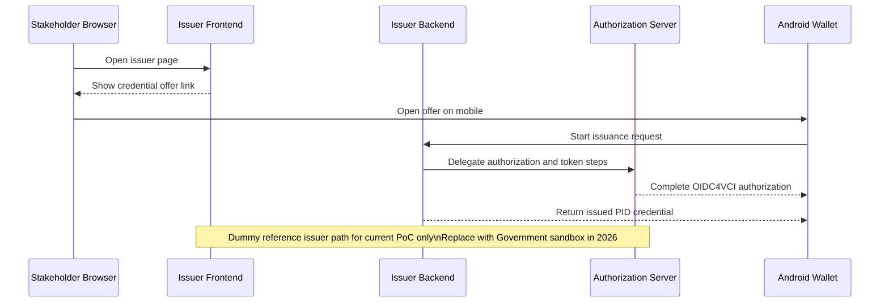

# Emerald Insurance Public Cloud Architecture

## Purpose

This note describes the public cloud proof-of-concept architecture that is currently built for the Emerald Insurance verifier demonstration.

It is intentionally architecture-focused. It does not repeat the operator steps from the wallet demo guide or the full deployment mechanics from the cloud runbook.

For authoritative operational detail, cross-reference:

- [Cloud Build And Deployment Runbook](Cloud_Build_Deployment_Runbook.md)
- [Emerald Insurance New Business Verifier Design](Emerald_Insurance_New_Business_Verifier_Design.md)
- [Emerald Insurance Existing Business Verifier Design](Emerald_Insurance_Existing_Business_Verifier_Design.md)
- [Stakeholder Wallet Demo Guide](Stakeholder_Wallet_Demo_Guide.md)

## Scope

This document covers the public `test` environment under `*.test.instech-eudi-poc.com`.

It reflects the architecture that is actually built today in the current proof of concept.

The current delivery emphasis remains verifier-first:

- primary delivery surfaces:
  - verifier web UI
  - verifier backend
- dummy or reference-backed supporting components for the current phase:
  - Android wallet
  - issuer frontend
  - issuer backend
  - authorization server

The wallet and issuer stack are current enabling components only. They are expected to be replaced by the Government sandbox in 2026.

## Architecture Summary

The public proof of concept exposes an Emerald Insurance branded verifier experience over a shared AWS `test` environment.

The verifier is split into two deployable runtime components:

- Angular verifier UI for journey selection, customer pages, and agent pages
- Kotlin verifier backend for OpenID4VP request generation, `request_uri` handling, wallet response processing, and Emerald Insurance case APIs

The issuance side remains available only to support end-to-end demonstration:

- issuer frontend for credential offer initiation
- issuer backend for issuance orchestration and metadata-driven credential behavior
- authorization server for OIDC4VCI and related token flows

The Android wallet currently acts as the mobile reference client for both issuance and presentation.

## 1. Cloud System Context

## 2. Cloud Deployment View

## 3. Verification Flow

This is the most important cloud interaction because the verifier is the current primary delivery surface.

## 4. Issuance Flow

This flow exists only to support the current proof-of-concept end-to-end demo. It is not the primary product target.

## Key Delivery Boundaries

- The verifier UI and verifier backend are the primary delivery surfaces for the current Emerald Insurance proof of concept.
- The wallet and issuer stack are present only to enable end-to-end issuance and verification in the current sandbox.
- The wallet and issuer stack should therefore be described as dummy or reference-backed components in stakeholder material.
- The 2026 target direction is to replace those supporting components with the Government sandbox rather than evolve them as product endpoints inside this program.

## Reader Guidance

Use this note when the audience needs a concise view of the public cloud architecture and the end-to-end interaction model.

Use [Stakeholder Wallet Demo Guide](Stakeholder_Wallet_Demo_Guide.md) when the audience needs the shortest practical operator instructions for installing the wallet, issuing a PID, and running the demo journeys.
